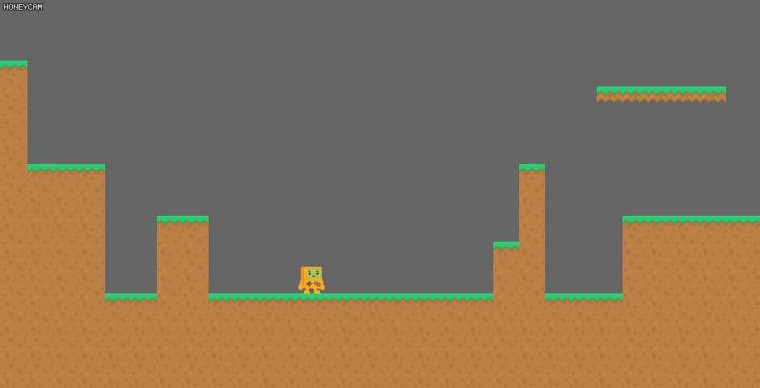
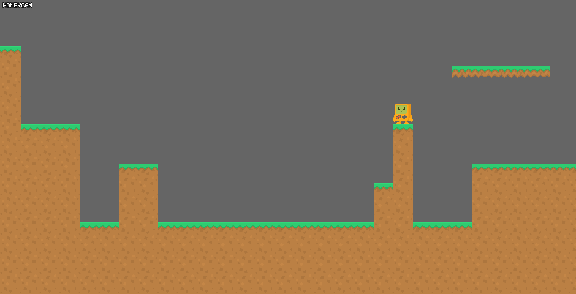
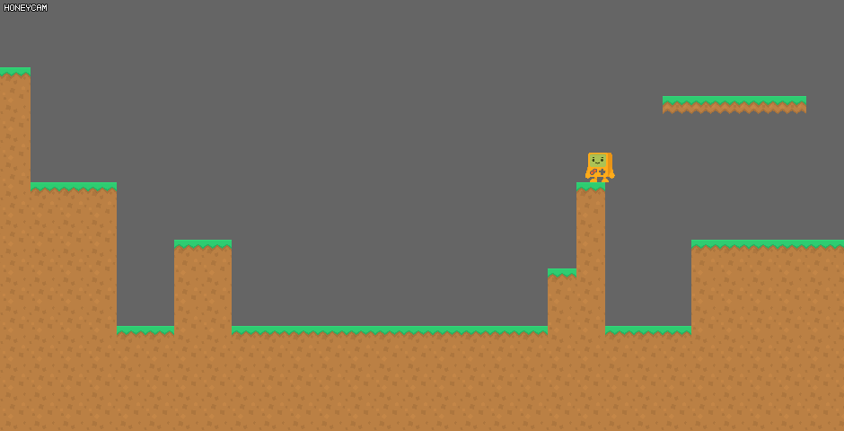

# Platformer

参考蔚蓝、空洞骑士、奥日、马里奥对平台跳跃游戏进行一些探索。

## 设计 1

- 场地
  - 方方正正的地面与墙壁
  - 基于 tilemap
  - 云朵平台
  - 移动平台
  - 小地图+转镜头
- 角色
  - 小跳+大跳+二段跳
  - 压墙减速下落
  - 蹬墙跳（不可爬高）
  - 带体力的攀爬
  - 加速跑
  - 空中冲刺
  - 可跟随平台移动
  - 可被道具施加动量
  - 土狼时间

## 之前的内容

较好的移动与较好的跳跃(大概吧)

低跳，大跳，二段跳

加速下落
